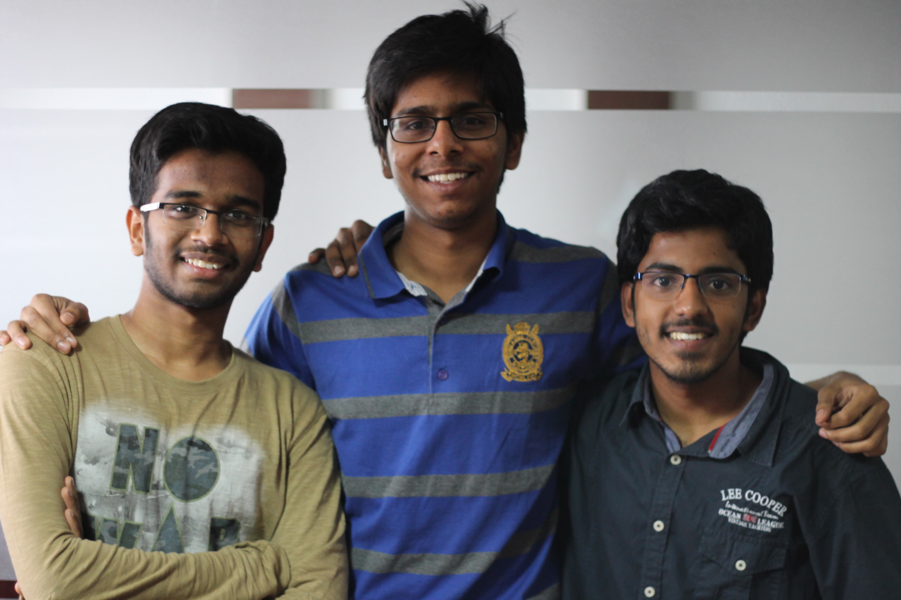

# inout_hack

# Metafrasimáton
Real time sign language to sign language  Translator

## Problem statement

According to Wikipedia, there are about 300 sign languages around the world & infact, there is no actual statistics or study on the number of languages. In fact, in countries like SriLanka & Tanzania, almost all schools for the mute have their own language. Given this, it makes it difficult for hearing & speech impaired people to interact or visit a place with a new sign languge. Looking at it from this angle, people haven't been including the impaired when we overcome our language barriers using softwares like Google Transalte.

## Solution

We have decided to pick up this problem statement and see how we can add inclusion & diversity to language tools. After 30 hours of intense hardwork, we have ended with an application, which traslates a real time sign language signs to another sign language. For the duration of the hackathon we have translated American Sign Language to Indian Sign Language.

## Technology
- Python
- Keras
- OpenCV

## Demo
 [https://vimeo.com/295005242](https://vimeo.com/295005242)

## Team -

### Smit Patel
[Github](https://github.com/smitpatel1996)

[LinkedIn](https://www.linkedin.com/in/smit-patel-a10301bb)

### Pranav S
[Github](https://github.com/pranavsr97)

[LinkedIn](www.linkedin.com/in/pranavseetharaman)

[Twitter](https://twitter.com/PranavSeetharam)

### Rajula Vineet Reddy
[Github](https://github.com/rajula96reddy)

[LinkedIn](https://www.linkedin.com/in/rajula-vineet-reddy-3ba601a7/)

[Twitter](https://twitter.com/rajula96reddy)

## References
- https://en.wikipedia.org/wiki/List_of_sign_languages
- http://www.talkinghands.co.in/
- http://www.aslpro.com/cgi-bin/aslpro/aslpro.cgi
- https://prezi.com/r3ja1ukeycla/american-indian-sign-language-vs-american-sign-language/
- https://github.com/EvilPort2/Sign-Language
- https://www.kaggle.com/datamunge/sign-language-mnist
